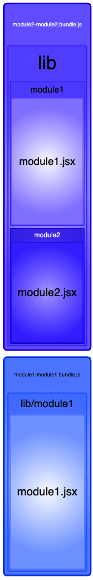

# Treeshaking With Loadable Components

Webpack's tree shaking does not seem to work properly with loadable components enabled.

## Try Out

```javascript
  yarn install
  yarn build
  open ./dist/analyze.html
```

## The Problem

As far as I am concerned, the problem here is that `module2-module2.bundle.js` contains module1.jsx although it only imports the named export `import { FOO_BAR } from '../module1/module1';` and tree shaking should take care of the rest.

Problem can be seen after building through [BundleAnalyzer's Output](./dist/analyze.html)

Here is a screenshot


